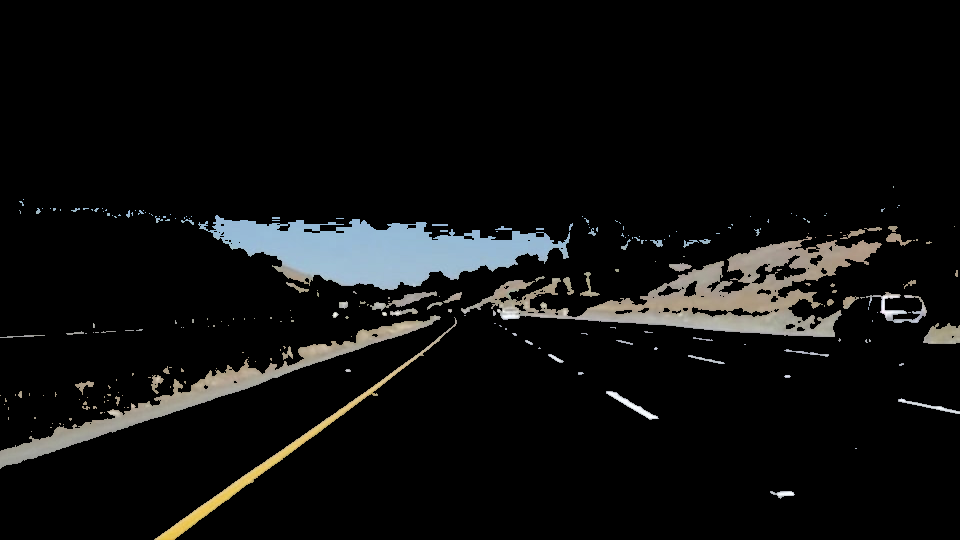
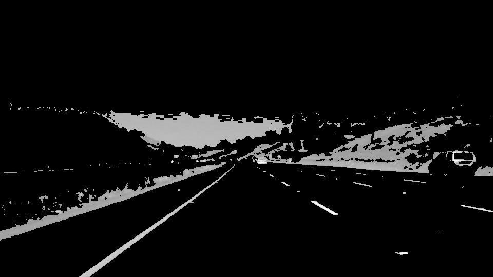
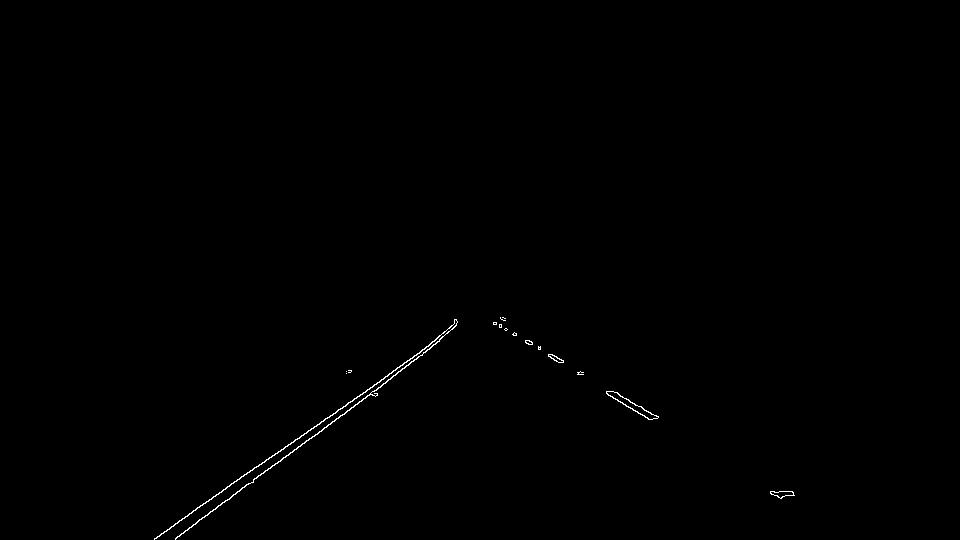
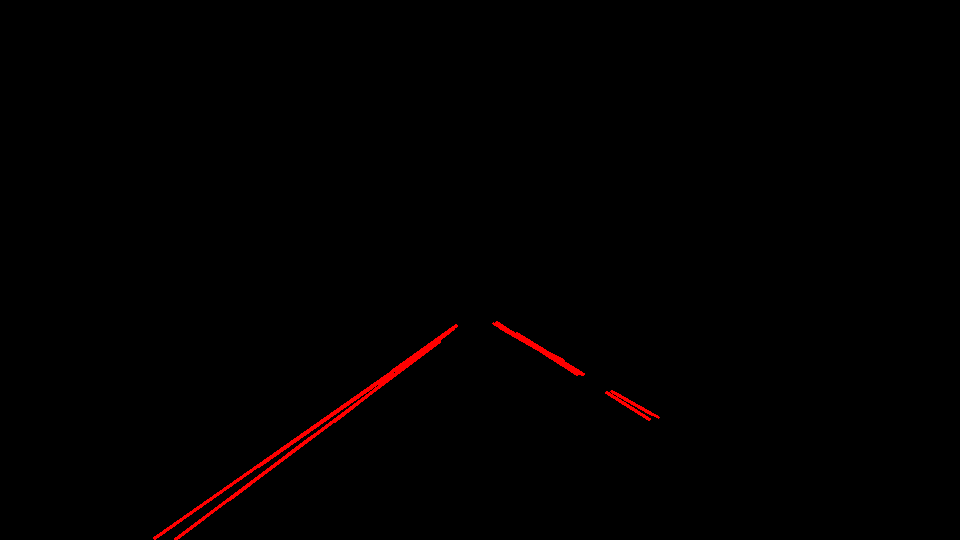
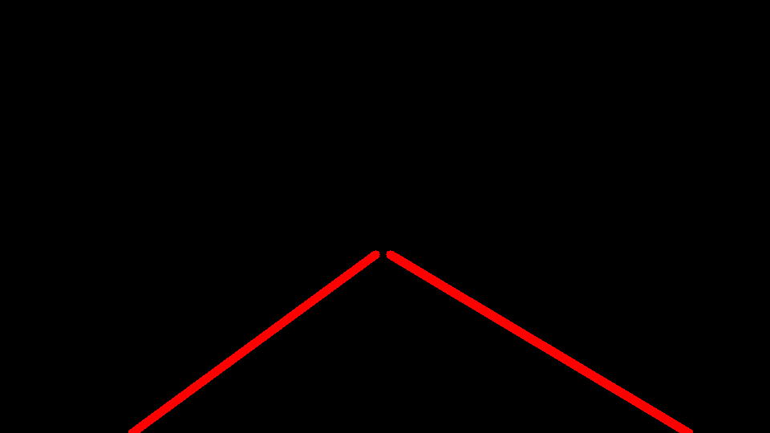
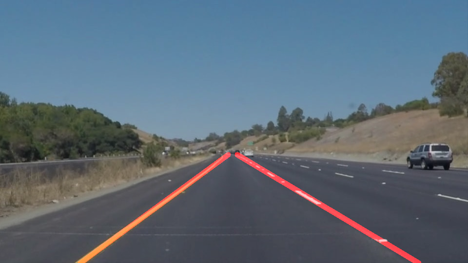

# **Finding Lane Lines on the Road** 

## Project Overview
This project implements a pipeline for processing images of a road and identify lane lines. The lane lines are then marked with red lines on the original image. The pipeline is used to process individual frames from a video shot from a running vehicle and mark lane lines on the video.

## Image processing pipeline
The pipeline uses tools like color selection, region of interest masking, gaussian blur, Edge detection and Hugh transforms to identify the lane lines. The pipeline consists of the following steps. 

An example image that is processed by the pipeline to identify lane lines is shown below.

**Step 1: Color selection**
Lane lines are either white or yellow in color. Using this property, the original image is processed to retain only yellow or white color is retained in the image. Yellow is formed by a mixture of Red and Green and white is formed by a mixture of RGB. Hence a RGB threshold of 150, 150, 50 is defined and all pixels that has values below this threshold is removed from the image. The resulting image is as below.

**Step 2: Gray scale**
The color selected image is then converted to gray scale as shown below.

**Step 3: Guassian Blur**
The gray scale image is then blurred using Gaussian blur to prepare for edge detection. A kernel size of 3 is found to be optimal for this stage. The output of this step is shown below

**Step 4: Region of interest**
In this step, a region of interest is defined where we expect the lane lines to be found. This eliminates the unnecessary content in the image as shown below.

**Step 5: Canny edge detection**
Using Canny edge detection, we detect the edges in the image. This gives us the edges in the image which looks like this

**Step 6: Hough transform**
The edge detected image is subject to Hough transform to identify straight lines. At this stage the straight lines are indicators of the lanes as shown

**Step 7: Lane line estimation and overlay**
Using the straight lines obtained from the Hough transofrm, the lane lines are extrapolated and marked in the image. The extrapolation of lane lines is required as the lane lines may be discontinuous and the lines got from Hough transform may not be full. The extrapolation logic also takes care of eliminating unwanted noise in the detected lines. The slope of the detected lanes in the previous frame is compared with the slope of the detected lines to eleminate unwanted lines from the final lane estimation. The final lines obtained from this process is shown below.

This lane lines image is then added on to the original image so that the lanes are marked on the original image as shown.

## Limitations of the pipeline
The pipeline makes a few assumptions and hence has the following limitations
1. The lane lines are assimed to be either yellow or white. If the lane color is different the pipeline fails to detect the lines
2. The camera posision assumed to be fixed. The region of interest selection will become invalid if the camera position with respect to the road varies (for example if the car moves over a hump)
3. Detection does not take into account of videos/images shot during night
4. Detection fails in situations where the road color matches the lane color where the edge of the lane is not distinctly visible.

## Improvements
This pipeline can be further improved to detect lanes with higher accuracy on different conditions. The following improvements are possible
1. Keep track of the lane lines from previous few frames (the current implementation stores data only from one previous frame) and use that data to fill in frames where the lane lines cannot be detected
2. Certain parameters are hardcoded (identified based on trial and error) in the detection algorithm that works well for the 3 videos provided. There is scope for improvement in determining these parameters in an adaptive way
3. Calculate the camera angle changes and do corrections to the lane positions based on this
